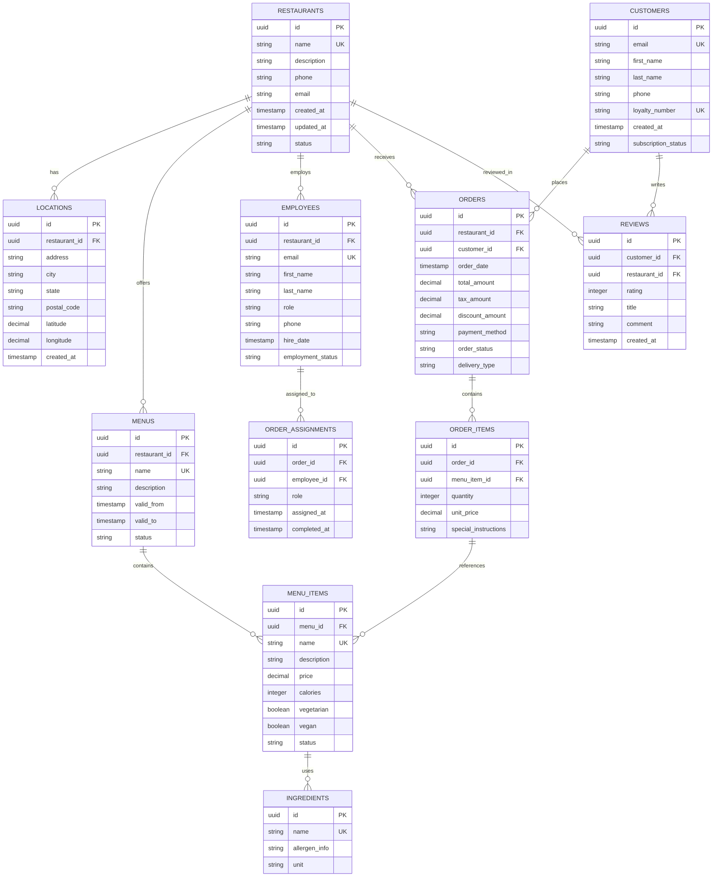

# Modelo de Datos Relacional - Sistema de Restaurantes

## Descripción General

Modelo relacional normalizado en PostgreSQL para gestionar restaurantes, menús, pedidos y clientes. El diseño sigue principios ACID, integridad referencial y normalización hasta FNBC (Boyce-Codd Normal Form).

---

## 1. Diagrama Entidad-Relación (Mermaid)



---

## 2. Definición de Entidades

### 2.1 RESTAURANTS
Información central de cada restaurante.

| Campo | Tipo | Restricción | Descripción |
|-------|------|-------------|-------------|
| `id` | UUID | PK | Identificador único |
| `name` | VARCHAR(255) | NOT NULL, UNIQUE | Nombre del restaurante |
| `description` | TEXT | | Descripción del negocio |
| `phone` | VARCHAR(20) | | Teléfono de contacto |
| `email` | VARCHAR(255) | | Email principal |
| `created_at` | TIMESTAMP | DEFAULT NOW() | Fecha de creación |
| `updated_at` | TIMESTAMP | DEFAULT NOW() | Última actualización |
| `status` | VARCHAR(50) | DEFAULT 'active' | Estado: active, inactive, suspended |

---

### 2.2 LOCATIONS
Ubicaciones/sucursales de restaurantes.

| Campo | Tipo | Restricción | Descripción |
|-------|------|-------------|-------------|
| `id` | UUID | PK | Identificador único |
| `restaurant_id` | UUID | FK, NOT NULL | Referencia a restaurante |
| `address` | VARCHAR(500) | NOT NULL | Dirección completa |
| `city` | VARCHAR(100) | NOT NULL | Ciudad |
| `state` | VARCHAR(100) | NOT NULL | Provincia/Estado |
| `postal_code` | VARCHAR(20) | NOT NULL | Código postal |
| `latitude` | DECIMAL(10,8) | | Coordenada geográfica |
| `longitude` | DECIMAL(11,8) | | Coordenada geográfica |
| `created_at` | TIMESTAMP | DEFAULT NOW() | Fecha de creación |

**Índices:**
- `restaurant_id` (mejora búsquedas por restaurante)
- `city, state` (búsquedas geográficas)

---

### 2.3 MENUS
Menús disponibles por restaurante (versionado).

| Campo | Tipo | Restricción | Descripción |
|-------|------|-------------|-------------|
| `id` | UUID | PK | Identificador único |
| `restaurant_id` | UUID | FK, NOT NULL | Referencia a restaurante |
| `name` | VARCHAR(255) | NOT NULL | Nombre del menú (ej: "Menú Desayuno") |
| `description` | TEXT | | Descripción del menú |
| `valid_from` | TIMESTAMP | NOT NULL | Fecha inicio validez |
| `valid_to` | TIMESTAMP | | Fecha fin validez |
| `status` | VARCHAR(50) | DEFAULT 'active' | Estado: active, draft, archived |

**Índices:**
- `restaurant_id` (búsquedas por restaurante)
- `valid_from, valid_to` (menús vigentes)

---

### 2.4 MENU_ITEMS
Platos/artículos del menú.

| Campo | Tipo | Restricción | Descripción |
|-------|------|-------------|-------------|
| `id` | UUID | PK | Identificador único |
| `menu_id` | UUID | FK, NOT NULL | Referencia a menú |
| `name` | VARCHAR(255) | NOT NULL | Nombre del plato |
| `description` | TEXT | | Descripción detallada |
| `price` | DECIMAL(10,2) | NOT NULL, CHECK > 0 | Precio en moneda local |
| `calories` | INTEGER | CHECK > 0 | Información nutricional |
| `vegetarian` | BOOLEAN | DEFAULT FALSE | Bandera dieta |
| `vegan` | BOOLEAN | DEFAULT FALSE | Bandera dieta |
| `status` | VARCHAR(50) | DEFAULT 'available' | Estado: available, unavailable, discontinued |

**Índices:**
- `menu_id` (búsquedas por menú)
- `vegetarian, vegan` (filtros de dieta)

---

### 2.5 INGREDIENTS
Ingredientes (tabla maestra compartida).

| Campo | Tipo | Restricción | Descripción |
|-------|------|-------------|-------------|
| `id` | UUID | PK | Identificador único |
| `name` | VARCHAR(255) | NOT NULL, UNIQUE | Nombre del ingrediente |
| `allergen_info` | TEXT | | Información de alérgenos |
| `unit` | VARCHAR(50) | | Unidad de medida (kg, L, piezas) |

**Relación:**
- M:N entre `MENU_ITEMS` e `INGREDIENTS` (tabla asociativa: `RECIPE`)

---

### 2.6 EMPLOYEES
Empleados del restaurante.

| Campo | Tipo | Restricción | Descripción |
|-------|------|-------------|-------------|
| `id` | UUID | PK | Identificador único |
| `restaurant_id` | UUID | FK, NOT NULL | Referencia a restaurante |
| `email` | VARCHAR(255) | NOT NULL, UNIQUE | Email único por empleado |
| `first_name` | VARCHAR(100) | NOT NULL | Nombre |
| `last_name` | VARCHAR(100) | NOT NULL | Apellido |
| `role` | VARCHAR(50) | NOT NULL | Rol: admin, chef, mesero, cajero, delivery |
| `phone` | VARCHAR(20) | | Teléfono de contacto |
| `hire_date` | TIMESTAMP | NOT NULL | Fecha de contratación |
| `employment_status` | VARCHAR(50) | DEFAULT 'active' | active, on_leave, terminated |

**Índices:**
- `restaurant_id, role` (búsquedas por rol y restaurante)
- `email` (autenticación)

---

### 2.7 CUSTOMERS
Clientes/usuarios del sistema.

| Campo | Tipo | Restricción | Descripción |
|-------|------|-------------|-------------|
| `id` | UUID | PK | Identificador único |
| `email` | VARCHAR(255) | NOT NULL, UNIQUE | Email de autenticación |
| `first_name` | VARCHAR(100) | NOT NULL | Nombre |
| `last_name` | VARCHAR(100) | NOT NULL | Apellido |
| `phone` | VARCHAR(20) | | Teléfono |
| `loyalty_number` | VARCHAR(50) | UNIQUE | Número de programa de lealtad |
| `created_at` | TIMESTAMP | DEFAULT NOW() | Fecha de registro |
| `subscription_status` | VARCHAR(50) | DEFAULT 'active' | active, inactive, suspended |

**Índices:**
- `email` (autenticación)
- `loyalty_number` (búsquedas por programa)

---

### 2.8 ORDERS
Pedidos realizados.

| Campo | Tipo | Restricción | Descripción |
|-------|------|-------------|-------------|
| `id` | UUID | PK | Identificador único |
| `restaurant_id` | UUID | FK, NOT NULL | Restaurante del pedido |
| `customer_id` | UUID | FK, NOT NULL | Cliente que realiza pedido |
| `order_date` | TIMESTAMP | NOT NULL, DEFAULT NOW() | Fecha/hora del pedido |
| `total_amount` | DECIMAL(10,2) | NOT NULL, CHECK > 0 | Monto total |
| `tax_amount` | DECIMAL(10,2) | DEFAULT 0 | Impuestos |
| `discount_amount` | DECIMAL(10,2) | DEFAULT 0 | Descuentos aplicados |
| `payment_method` | VARCHAR(50) | | Método: credit_card, debit_card, cash, digital_wallet |
| `order_status` | VARCHAR(50) | DEFAULT 'pending' | pending, confirmed, preparing, ready, delivered, cancelled |
| `delivery_type` | VARCHAR(50) | | Tipo: dine_in, takeout, delivery |

**Índices:**
- `restaurant_id` (búsquedas por restaurante)
- `customer_id` (historial de cliente)
- `order_date` (reportes temporales)
- `order_status` (filtros de estado)

---

### 2.9 ORDER_ITEMS
Detalles de ítems en cada pedido.

| Campo | Tipo | Restricción | Descripción |
|-------|------|-------------|-------------|
| `id` | UUID | PK | Identificador único |
| `order_id` | UUID | FK, NOT NULL | Referencia a pedido |
| `menu_item_id` | UUID | FK, NOT NULL | Referencia a plato |
| `quantity` | INTEGER | NOT NULL, CHECK > 0 | Cantidad |
| `unit_price` | DECIMAL(10,2) | NOT NULL, CHECK > 0 | Precio al momento del pedido |
| `special_instructions` | TEXT | | Instrucciones especiales (sin cebolla, etc.) |

**Índices:**
- `order_id` (búsqueda de ítems por orden)

---

### 2.10 ORDER_ASSIGNMENTS
Asignaciones de empleados a pedidos.

| Campo | Tipo | Restricción | Descripción |
|-------|------|-------------|-------------|
| `id` | UUID | PK | Identificador único |
| `order_id` | UUID | FK, NOT NULL | Referencia a pedido |
| `employee_id` | UUID | FK, NOT NULL | Empleado asignado |
| `role` | VARCHAR(50) | NOT NULL | Rol en el pedido: chef, mesero, delivery |
| `assigned_at` | TIMESTAMP | DEFAULT NOW() | Fecha asignación |
| `completed_at` | TIMESTAMP | | Fecha finalización |

**Índices:**
- `order_id` (búsqueda por orden)
- `employee_id` (historial de empleado)

---

### 2.11 REVIEWS
Reseñas y calificaciones.

| Campo | Tipo | Restricción | Descripción |
|-------|------|-------------|-------------|
| `id` | UUID | PK | Identificador único |
| `customer_id` | UUID | FK, NOT NULL | Cliente que califica |
| `restaurant_id` | UUID | FK, NOT NULL | Restaurante calificado |
| `rating` | INTEGER | NOT NULL, CHECK BETWEEN 1 AND 5 | Puntuación |
| `title` | VARCHAR(255) | | Título de la reseña |
| `comment` | TEXT | | Comentario detallado |
| `created_at` | TIMESTAMP | DEFAULT NOW() | Fecha de creseña |

**Índices:**
- `restaurant_id` (reseñas por restaurante)
- `customer_id` (reseñas del cliente)
- `created_at` (ordenamiento temporal)

---

## 3. Script DDL (Data Definition Language)

```sql
-- Crear extensiones necesarias
CREATE EXTENSION IF NOT EXISTS "uuid-ossp";
CREATE EXTENSION IF NOT EXISTS "pg_trgm";  -- Para búsquedas de texto

-- Tabla: RESTAURANTS
CREATE TABLE IF NOT EXISTS restaurants (
    id UUID PRIMARY KEY DEFAULT uuid_generate_v4(),
    name VARCHAR(255) NOT NULL UNIQUE,
    description TEXT,
    phone VARCHAR(20),
    email VARCHAR(255),
    created_at TIMESTAMP NOT NULL DEFAULT NOW(),
    updated_at TIMESTAMP NOT NULL DEFAULT NOW(),
    status VARCHAR(50) NOT NULL DEFAULT 'active' CHECK (status IN ('active', 'inactive', 'suspended')),
    CONSTRAINT email_format CHECK (email ~* '^[A-Za-z0-9._%+-]+@[A-Za-z0-9.-]+\.[A-Z|a-z]{2,}$')
);

CREATE INDEX idx_restaurants_name ON restaurants USING GIN (name gin_trgm_ops);
CREATE INDEX idx_restaurants_status ON restaurants(status);

-- Tabla: LOCATIONS
CREATE TABLE IF NOT EXISTS locations (
    id UUID PRIMARY KEY DEFAULT uuid_generate_v4(),
    restaurant_id UUID NOT NULL REFERENCES restaurants(id) ON DELETE CASCADE,
    address VARCHAR(500) NOT NULL,
    city VARCHAR(100) NOT NULL,
    state VARCHAR(100) NOT NULL,
    postal_code VARCHAR(20) NOT NULL,
    latitude DECIMAL(10,8),
    longitude DECIMAL(11,8),
    created_at TIMESTAMP NOT NULL DEFAULT NOW(),
    CONSTRAINT valid_coordinates CHECK ((latitude IS NULL AND longitude IS NULL) OR (latitude IS NOT NULL AND longitude IS NOT NULL))
);

CREATE INDEX idx_locations_restaurant ON locations(restaurant_id);
CREATE INDEX idx_locations_city_state ON locations(city, state);
CREATE INDEX idx_locations_geo ON locations USING GIST (ll_to_earth(latitude, longitude));

-- Tabla: MENUS
CREATE TABLE IF NOT EXISTS menus (
    id UUID PRIMARY KEY DEFAULT uuid_generate_v4(),
    restaurant_id UUID NOT NULL REFERENCES restaurants(id) ON DELETE CASCADE,
    name VARCHAR(255) NOT NULL,
    description TEXT,
    valid_from TIMESTAMP NOT NULL,
    valid_to TIMESTAMP,
    status VARCHAR(50) NOT NULL DEFAULT 'active' CHECK (status IN ('active', 'draft', 'archived')),
    created_at TIMESTAMP NOT NULL DEFAULT NOW(),
    CONSTRAINT valid_dates CHECK (valid_to IS NULL OR valid_to > valid_from),
    CONSTRAINT unique_restaurant_menu UNIQUE (restaurant_id, name, valid_from)
);

CREATE INDEX idx_menus_restaurant ON menus(restaurant_id);
CREATE INDEX idx_menus_validity ON menus(valid_from, valid_to);

-- Tabla: MENU_ITEMS
CREATE TABLE IF NOT EXISTS menu_items (
    id UUID PRIMARY KEY DEFAULT uuid_generate_v4(),
    menu_id UUID NOT NULL REFERENCES menus(id) ON DELETE CASCADE,
    name VARCHAR(255) NOT NULL,
    description TEXT,
    price DECIMAL(10,2) NOT NULL CHECK (price > 0),
    calories INTEGER CHECK (calories > 0 OR calories IS NULL),
    vegetarian BOOLEAN NOT NULL DEFAULT FALSE,
    vegan BOOLEAN NOT NULL DEFAULT FALSE,
    status VARCHAR(50) NOT NULL DEFAULT 'available' CHECK (status IN ('available', 'unavailable', 'discontinued')),
    created_at TIMESTAMP NOT NULL DEFAULT NOW(),
    CONSTRAINT vegan_implies_vegetarian CHECK (NOT vegan OR vegetarian)
);

CREATE INDEX idx_menu_items_menu ON menu_items(menu_id);
CREATE INDEX idx_menu_items_dietary ON menu_items(vegetarian, vegan);
CREATE INDEX idx_menu_items_status ON menu_items(status);

-- Tabla: INGREDIENTS
CREATE TABLE IF NOT EXISTS ingredients (
    id UUID PRIMARY KEY DEFAULT uuid_generate_v4(),
    name VARCHAR(255) NOT NULL UNIQUE,
    allergen_info TEXT,
    unit VARCHAR(50),
    created_at TIMESTAMP NOT NULL DEFAULT NOW()
);

CREATE INDEX idx_ingredients_name ON ingredients USING GIN (name gin_trgm_ops);

-- Tabla: RECIPE (relación M:N entre MENU_ITEMS e INGREDIENTS)
CREATE TABLE IF NOT EXISTS recipe (
    id UUID PRIMARY KEY DEFAULT uuid_generate_v4(),
    menu_item_id UUID NOT NULL REFERENCES menu_items(id) ON DELETE CASCADE,
    ingredient_id UUID NOT NULL REFERENCES ingredients(id) ON DELETE RESTRICT,
    quantity DECIMAL(10,2) NOT NULL CHECK (quantity > 0),
    created_at TIMESTAMP NOT NULL DEFAULT NOW(),
    CONSTRAINT unique_recipe UNIQUE (menu_item_id, ingredient_id)
);

CREATE INDEX idx_recipe_menu_item ON recipe(menu_item_id);
CREATE INDEX idx_recipe_ingredient ON recipe(ingredient_id);

-- Tabla: EMPLOYEES
CREATE TABLE IF NOT EXISTS employees (
    id UUID PRIMARY KEY DEFAULT uuid_generate_v4(),
    restaurant_id UUID NOT NULL REFERENCES restaurants(id) ON DELETE CASCADE,
    email VARCHAR(255) NOT NULL UNIQUE,
    first_name VARCHAR(100) NOT NULL,
    last_name VARCHAR(100) NOT NULL,
    role VARCHAR(50) NOT NULL CHECK (role IN ('admin', 'chef', 'mesero', 'cajero', 'delivery')),
    phone VARCHAR(20),
    hire_date TIMESTAMP NOT NULL,
    employment_status VARCHAR(50) NOT NULL DEFAULT 'active' CHECK (employment_status IN ('active', 'on_leave', 'terminated')),
    created_at TIMESTAMP NOT NULL DEFAULT NOW(),
    CONSTRAINT email_format CHECK (email ~* '^[A-Za-z0-9._%+-]+@[A-Za-z0-9.-]+\.[A-Z|a-z]{2,}$')
);

CREATE INDEX idx_employees_restaurant_role ON employees(restaurant_id, role);
CREATE INDEX idx_employees_email ON employees(email);
CREATE INDEX idx_employees_status ON employees(employment_status);

-- Tabla: CUSTOMERS
CREATE TABLE IF NOT EXISTS customers (
    id UUID PRIMARY KEY DEFAULT uuid_generate_v4(),
    email VARCHAR(255) NOT NULL UNIQUE,
    first_name VARCHAR(100) NOT NULL,
    last_name VARCHAR(100) NOT NULL,
    phone VARCHAR(20),
    loyalty_number VARCHAR(50) UNIQUE,
    created_at TIMESTAMP NOT NULL DEFAULT NOW(),
    subscription_status VARCHAR(50) NOT NULL DEFAULT 'active' CHECK (subscription_status IN ('active', 'inactive', 'suspended')),
    CONSTRAINT email_format CHECK (email ~* '^[A-Za-z0-9._%+-]+@[A-Za-z0-9.-]+\.[A-Z|a-z]{2,}$')
);

CREATE INDEX idx_customers_email ON customers(email);
CREATE INDEX idx_customers_loyalty ON customers(loyalty_number);
CREATE INDEX idx_customers_status ON customers(subscription_status);

-- Tabla: ORDERS
CREATE TABLE IF NOT EXISTS orders (
    id UUID PRIMARY KEY DEFAULT uuid_generate_v4(),
    restaurant_id UUID NOT NULL REFERENCES restaurants(id) ON DELETE RESTRICT,
    customer_id UUID NOT NULL REFERENCES customers(id) ON DELETE RESTRICT,
    order_date TIMESTAMP NOT NULL DEFAULT NOW(),
    total_amount DECIMAL(10,2) NOT NULL CHECK (total_amount > 0),
    tax_amount DECIMAL(10,2) NOT NULL DEFAULT 0 CHECK (tax_amount >= 0),
    discount_amount DECIMAL(10,2) NOT NULL DEFAULT 0 CHECK (discount_amount >= 0),
    payment_method VARCHAR(50) CHECK (payment_method IN ('credit_card', 'debit_card', 'cash', 'digital_wallet')),
    order_status VARCHAR(50) NOT NULL DEFAULT 'pending' CHECK (order_status IN ('pending', 'confirmed', 'preparing', 'ready', 'delivered', 'cancelled')),
    delivery_type VARCHAR(50) CHECK (delivery_type IN ('dine_in', 'takeout', 'delivery')),
    created_at TIMESTAMP NOT NULL DEFAULT NOW(),
    updated_at TIMESTAMP NOT NULL DEFAULT NOW()
);

CREATE INDEX idx_orders_restaurant ON orders(restaurant_id);
CREATE INDEX idx_orders_customer ON orders(customer_id);
CREATE INDEX idx_orders_date ON orders(order_date);
CREATE INDEX idx_orders_status ON orders(order_status);
CREATE INDEX idx_orders_delivery ON orders(delivery_type);

-- Tabla: ORDER_ITEMS
CREATE TABLE IF NOT EXISTS order_items (
    id UUID PRIMARY KEY DEFAULT uuid_generate_v4(),
    order_id UUID NOT NULL REFERENCES orders(id) ON DELETE CASCADE,
    menu_item_id UUID NOT NULL REFERENCES menu_items(id) ON DELETE RESTRICT,
    quantity INTEGER NOT NULL CHECK (quantity > 0),
    unit_price DECIMAL(10,2) NOT NULL CHECK (unit_price > 0),
    special_instructions TEXT,
    created_at TIMESTAMP NOT NULL DEFAULT NOW()
);

CREATE INDEX idx_order_items_order ON order_items(order_id);
CREATE INDEX idx_order_items_menu_item ON order_items(menu_item_id);

-- Tabla: ORDER_ASSIGNMENTS
CREATE TABLE IF NOT EXISTS order_assignments (
    id UUID PRIMARY KEY DEFAULT uuid_generate_v4(),
    order_id UUID NOT NULL REFERENCES orders(id) ON DELETE CASCADE,
    employee_id UUID NOT NULL REFERENCES employees(id) ON DELETE RESTRICT,
    role VARCHAR(50) NOT NULL CHECK (role IN ('chef', 'mesero', 'delivery')),
    assigned_at TIMESTAMP NOT NULL DEFAULT NOW(),
    completed_at TIMESTAMP,
    created_at TIMESTAMP NOT NULL DEFAULT NOW(),
    CONSTRAINT valid_completion CHECK (completed_at IS NULL OR completed_at >= assigned_at)
);

CREATE INDEX idx_order_assignments_order ON order_assignments(order_id);
CREATE INDEX idx_order_assignments_employee ON order_assignments(employee_id);
CREATE INDEX idx_order_assignments_role ON order_assignments(role);

-- Tabla: REVIEWS
CREATE TABLE IF NOT EXISTS reviews (
    id UUID PRIMARY KEY DEFAULT uuid_generate_v4(),
    customer_id UUID NOT NULL REFERENCES customers(id) ON DELETE CASCADE,
    restaurant_id UUID NOT NULL REFERENCES restaurants(id) ON DELETE CASCADE,
    rating INTEGER NOT NULL CHECK (rating BETWEEN 1 AND 5),
    title VARCHAR(255),
    comment TEXT,
    created_at TIMESTAMP NOT NULL DEFAULT NOW(),
    CONSTRAINT unique_review UNIQUE (customer_id, restaurant_id, DATE(created_at))
);

CREATE INDEX idx_reviews_restaurant ON reviews(restaurant_id);
CREATE INDEX idx_reviews_customer ON reviews(customer_id);
CREATE INDEX idx_reviews_date ON reviews(created_at);
CREATE INDEX idx_reviews_rating ON reviews(rating);
```

---

## 4. Relaciones y Restricciones

### Relaciones (1:N y M:N)

| Relación | Tipo | Descripción | Integridad |
|----------|------|-------------|-----------|
| RESTAURANTS → LOCATIONS | 1:N | Restaurante tiene múltiples ubicaciones | ON DELETE CASCADE |
| RESTAURANTS → MENUS | 1:N | Restaurante ofrece varios menús | ON DELETE CASCADE |
| RESTAURANTS → EMPLOYEES | 1:N | Restaurante contrata empleados | ON DELETE CASCADE |
| RESTAURANTS → ORDERS | 1:N | Restaurante recibe pedidos | ON DELETE RESTRICT |
| RESTAURANTS → REVIEWS | 1:N | Restaurante recibe reseñas | ON DELETE CASCADE |
| MENUS → MENU_ITEMS | 1:N | Menú contiene ítems | ON DELETE CASCADE |
| MENU_ITEMS → INGREDIENTS | M:N | Platos usan ingredientes | Via tabla RECIPE |
| CUSTOMERS → ORDERS | 1:N | Cliente realiza pedidos | ON DELETE RESTRICT |
| CUSTOMERS → REVIEWS | 1:N | Cliente escribe reseñas | ON DELETE CASCADE |
| ORDERS → ORDER_ITEMS | 1:N | Pedido contiene ítems | ON DELETE CASCADE |
| ORDERS → ORDER_ASSIGNMENTS | 1:N | Pedido asignado a empleados | ON DELETE CASCADE |
| EMPLOYEES → ORDER_ASSIGNMENTS | 1:N | Empleado asignado a pedidos | ON DELETE RESTRICT |

### Restricciones de Integridad

1. **Entidad**: Todos los registros requieren clave primaria (UUID)
2. **Referencial**: FK con validación ON DELETE CASCADE/RESTRICT según criticidad
3. **Dominio**: CHECK constraints para valores válidos
4. **Unicidad**: UNIQUE para campos naturales (email, name, loyalty_number)
5. **Lógica**: 
   - Vegan ⟹ Vegetarian
   - Coordenadas válidas o NULL
   - Fechas válidas (valid_to > valid_from)
   - Montos positivos (precios, totales)

---

## 5. Normalización

**Forma Normal Boyce-Codd (FNBC):**

✓ **1NF**: Todos los atributos son atómicos  
✓ **2NF**: Sin dependencias parciales  
✓ **3NF**: Sin dependencias transitivas  
✓ **FNBC**: Todo determinante es clave candidata  

**Tabla de Desnormalización Justificada:**
- `ORDER_ITEMS.unit_price`: Copia de `MENU_ITEMS.price` al momento del pedido (histórico)

---

## 6. Estrategia de Indexación

### Índices Críticos
- **Búsquedas frecuentes**: `restaurant_id`, `customer_id`, `order_status`
- **Texto**: GIN indexes en `name` campos usando trigrama
- **Temporal**: Índices compuestos en `valid_from, valid_to`
- **Geográfica**: Índice GIST para ubicaciones

### Índices Secundarios
- Email (autenticación)
- Loyalty number (cliente)
- Rol + Restaurante (empleados)

---

## 7. Consideraciones de Rendimiento

### Particionamiento (Para datos masivos)
```sql
-- Ejemplo: Particionar ORDERS por rango de fecha
CREATE TABLE orders_y2025 PARTITION OF orders
  FOR VALUES FROM ('2025-01-01') TO ('2026-01-01');
```

### Archivado Histórico
- Implementar soft deletes con `deleted_at` si es necesario auditoría
- Mantener tabla `orders` completa (nunca eliminar órdenes)

### Caché a Nivel Aplicación
- Cachear menús vigentes (cambian diariamente)
- Cachear ingredientes (static maestra)
- Cachear ratings de restaurantes (recalcular cada hora)

---

## 8. Migraciones Futuras

- **Pagos**: Tabla separada `PAYMENTS` con transacciones
- **Inventario**: `STOCK_ITEMS`, `STOCK_MOVEMENTS` para ingredientes
- **Promociones**: `PROMOTIONS`, `PROMO_RULES` para descuentos dinámicos
- **Auditoría**: Tabla `AUDIT_LOG` para compliance

---

## Resumen de Artefactos

| Artefacto | Cantidad | Descripción |
|-----------|----------|-------------|
| Entidades | 11 | RESTAURANTS, LOCATIONS, MENUS, MENU_ITEMS, INGREDIENTS, EMPLOYEES, CUSTOMERS, ORDERS, ORDER_ITEMS, ORDER_ASSIGNMENTS, REVIEWS |
| Relaciones | 14 | Cubre 1:N y M:N |
| Índices | 25+ | Optimizados por patrón de acceso |
| Constraints | 40+ | Integridad referencial, dominio y lógica |
| UUID PKs | 11 | Para escalabilidad distribuida |
| Timestamps | Auditoría | created_at, updated_at en tablas maestras |

**Normalización**: FNBC | **Motor**: PostgreSQL 13+ | **Patrón**: Arquitectura OLTP
